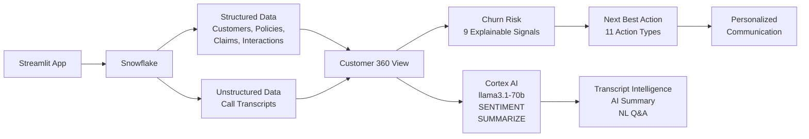

# Customer360 AI

**AI-Powered Customer Intelligence & Next Best Action for Insurance**

> UNIFY customer data + conversations &rarr; UNDERSTAND risk &rarr; PREDICT churn &rarr; RECOMMEND the next best action &rarr; ACT with personalized outreach

---

## Problem

Insurers and lenders struggle with fragmented customer data spread across policies, claims, call center interactions, and unstructured conversations. Relationship managers lack a unified view of customer health, making it difficult to identify at-risk customers before they churn.

**Customer360 AI** solves this by unifying structured and unstructured customer touchpoints into a 360-degree view, then using Snowflake Cortex AI to analyze sentiment, explain churn risk, and recommend the next best action — all within a single application.

## Solution

Customer360 AI combines:

- **Structured data**: Customers, policies, claims, interactions
- **Unstructured data**: Call transcripts with realistic multi-turn conversations
- **Sentiment analysis**: Cortex-powered sentiment scoring and trend detection
- **Explainable churn risk**: 9-signal scoring model with human-readable explanations
- **Next Best Action engine**: Deterministic rules mapping customer signals to prioritized actions
- **AI-powered insights**: Natural language summaries, transcript intelligence, and Q&A
- **Personalized communication**: AI-generated phone scripts, emails, and SMS drafts

## Architecture



## Key Features

### Executive Dashboard
- Real-time KPIs: customer count, risk distribution, sentiment, open claims
- AI Executive Insight generated from actual Snowflake data
- Customers Requiring Attention table with priority actions

### Customer 360
- Unified customer profile with churn risk and health score
- **Why This Customer Needs Attention** — immediately visible risk drivers
- **Next Best Action** — side-by-side with risk explanation
- Visual customer journey: Signals &rarr; Risk &rarr; AI Analysis &rarr; Recommendation &rarr; Action
- Policy portfolio, claims history, interaction timeline
- Transcript intelligence and AI relationship summary
- Personalized communication generator (phone/email/SMS)

### Ask Customer 360
- Natural language Q&A powered by Cortex COMPLETE
- Queries structured Snowflake data and transcript intelligence
- Evidence-based answers with follow-up actions

### Action Center
- Operational work queue: "Who should I contact and what should I do?"
- Filterable by priority, risk, segment, and trigger
- Direct navigation to Customer 360

### Customer Analytics
- Risk, sentiment, health, claims, and channel distribution charts
- Risk by customer segment breakdown

## Data Model

| Table | Rows | Description |
|---|---|---|
| `CUSTOMERS` | 500 | Demographics, segments, CLV, status |
| `POLICIES` | ~780 | Auto, Home, Life, Health policies |
| `CLAIMS` | ~700 | Claims with status, severity, processing time |
| `CUSTOMER_INTERACTIONS` | ~2,400 | Multi-channel interactions with sentiment |
| `CALL_TRANSCRIPTS` | ~1,100 | Realistic conversation text |

All data is **synthetic** — no real customer information is included.

### Relationships
- Customers &rarr; Policies (1:many)
- Policies &rarr; Claims (1:many)
- Customers &rarr; Interactions (1:many)
- Customers &rarr; Call Transcripts (1:many)
- Interactions &harr; Call Transcripts (1:1 where available)

## Cortex AI Integration

| Function | Usage |
|---|---|
| `CORTEX.COMPLETE` (llama3.1-70b) | Transcript intelligence, AI summaries, NL Q&A, communication generation |
| `CORTEX.SENTIMENT` | Real-time sentiment scoring of transcript text |
| `CORTEX.SUMMARIZE` | Transcript summarization |

## Explainable Churn Risk

The churn risk score (0-100) is composed of **9 transparent signals**:

| Signal | Max Points | Source |
|---|---|---|
| Negative sentiment | 20 | Interaction sentiment scores |
| Complaint frequency | 15 | Complaint interaction count |
| Cancellation intent | 20 | Cancellation interactions + transcript intent |
| Open/delayed claims | 15 | Claims with pending status or >30 day processing |
| Payment issues | 10 | Late/overdue/delinquent payment status |
| Renewal proximity | 10 | Days until next policy renewal |
| Unresolved issues | 10 | Unresolved or escalated interactions |
| Churn transcript signals | 15 | Transcript-detected churn intent |
| Sentiment deterioration | 5 | Recent sentiment worse than average |

Every risk classification includes the specific drivers with supporting data evidence, clearly distinguishing **data facts** from **AI interpretation**.

## Next Best Action Engine

11 deterministic action types based on customer signals:

| Action | Trigger |
|---|---|
| Escalate Claim | Open high-value claim + complaints |
| Retention Outreach | High CLV + cancellation intent |
| Renewal Retention | Cancellation + renewal approaching |
| Expedite Claim | Delayed + open claims |
| Payment Assistance | Payment issues + multiple policies |
| Proactive Call | Negative sentiment + upcoming renewal |
| Service Recovery | Multiple complaints |
| Resolve Issues | Multiple unresolved interactions |
| Claim Follow-up | Open claims (lower value) |
| Renewal Review | Approaching renewal + non-low risk |
| Payment Resolution | Payment issues only |

## Demo Customer

**CUST-0340 — Emily Mitchell** is the primary demo customer (all values retrieved dynamically from Snowflake):

- Premium segment, ~$53K CLV
- Churn risk: HIGH (~88/100), Health: ~10/100
- 4 cancellation interactions, negative sentiment
- Open ~$35K claim under review
- Policy renewal approaching (~25 days)
- Overdue payment on Life policy

### Golden Demo Flow

1. **Executive Dashboard** &rarr; see customers requiring attention
2. **Customer 360** &rarr; select Emily Mitchell
3. See risk signals + Next Best Action immediately
4. **Transcript Intelligence** &rarr; what Emily actually said
5. **AI Summary** &rarr; comprehensive relationship analysis
6. **Communication** &rarr; generate personalized phone script
7. **Ask Customer 360** &rarr; "Why is Emily likely to churn?"
8. **Action Center** &rarr; Emily in the operational queue

## Setup

### Prerequisites
- Snowflake account with Cortex AI enabled (llama3.1-70b, SENTIMENT, SUMMARIZE)
- Python 3.9+
- A warehouse (e.g., `COMPUTE_WH`)

### 1. Clone the repository
```bash
git clone https://github.com/YOUR_USERNAME/customer360-ai.git
cd customer360-ai
```

### 2. Install dependencies
```bash
pip install -r requirements.txt
```

### 3. Configure Snowflake connection
```bash
cp .streamlit/secrets.toml.example .streamlit/secrets.toml
# Edit .streamlit/secrets.toml with your Snowflake credentials
```

### 4. Run SQL setup (in Snowflake)
Execute the SQL scripts in order:
```
sql/01_tables.sql          -- Create database, schema, and tables
sql/02_generate_data.sql   -- Generate synthetic data
sql/03_views_and_functions.sql  -- Create views and Cortex AI functions
```

### 5. Launch the application
```bash
streamlit run app.py
```

The application will be available at `http://localhost:8501`.

### Streamlit in Snowflake
The application also supports running inside Streamlit in Snowflake (SiS). The connection layer automatically detects the active Snowpark session when running in SiS.

## Project Structure

```
customer360-ai/
├── app.py                              # Main entry point + navigation + styling
├── requirements.txt                    # Python dependencies
├── .gitignore
├── .streamlit/
│   └── secrets.toml.example            # Connection config template
├── views/
│   ├── dashboard.py                    # Executive Dashboard
│   ├── customer_360.py                 # Customer 360 (primary screen)
│   ├── ask_customer_360.py             # Natural Language Q&A
│   ├── action_center.py                # Operational work queue
│   └── analytics.py                    # Management analytics
├── components/
│   ├── kpi_cards.py                    # KPI card rendering
│   ├── customer_header.py              # Customer profile header
│   ├── risk_panel.py                   # Explainable churn risk
│   ├── transcript_panel.py             # Transcript intelligence
│   ├── nba_card.py                     # Next Best Action card
│   └── communication_panel.py          # Personalized communication
├── utils/
│   ├── snowflake.py                    # Connection + query functions
│   └── formatting.py                   # Display formatting utilities
└── sql/
    ├── 01_tables.sql                   # Database and table DDL
    ├── 02_generate_data.sql            # Synthetic data generation
    └── 03_views_and_functions.sql       # Views and Cortex AI functions
```

## Known Limitations

- **Cortex AI latency**: LLM calls (transcript analysis, AI summary, communication generation) take 5-15 seconds each
- **Aggregate NL Q&A**: When no specific customer is selected, the system uses the top 15 customers by risk score due to LLM context limits
- **Transcript intelligence**: Uses the 5 most recent transcripts per customer
- **AI-generated communications**: Presented as drafts requiring human review — the application does not automatically send communications
- **Synthetic data**: All customer data is generated programmatically for demonstration purposes

## Security

- No production customer data is included in this repository
- No credentials or secrets are committed
- `.streamlit/secrets.toml` is excluded via `.gitignore`
- All AI-generated content is clearly labeled in the UI

## Technology

- **Snowflake** — Primary data platform
- **Snowflake Cortex AI** — LLM (llama3.1-70b), SENTIMENT, SUMMARIZE
- **Streamlit** — Application UI
- **Python** — Application logic

---

*Built for the Snowflake CoCo Hackathon*
